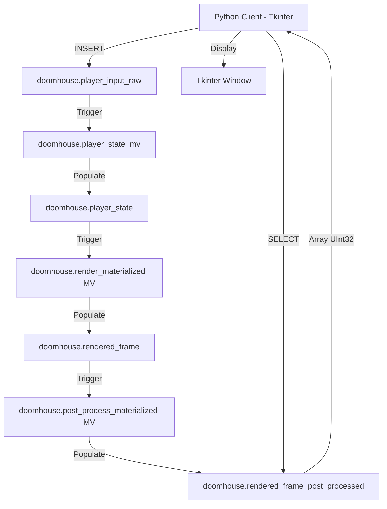
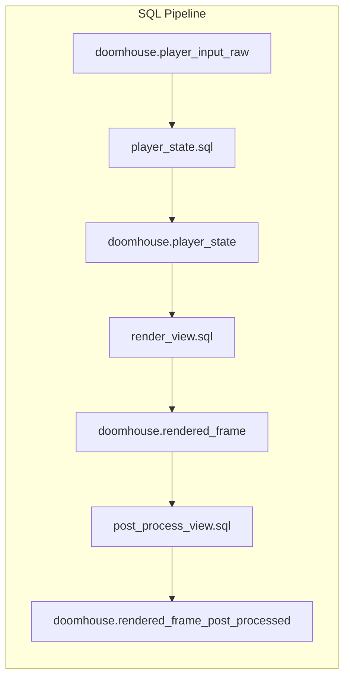
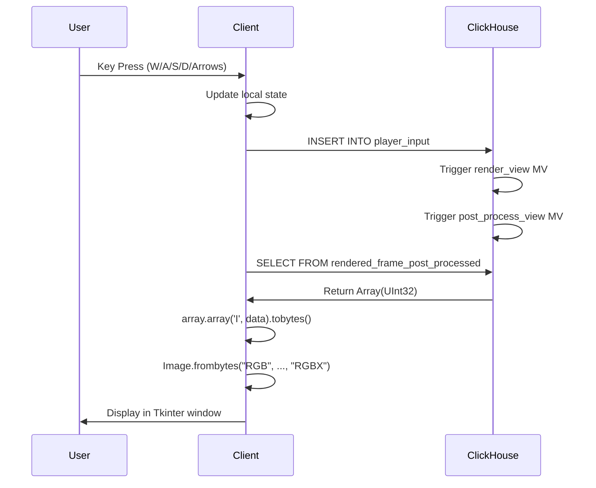

# DOOMHouse Architecture

## System Overview

DOOMHouse follows a unique client-server architecture where the database acts as the rendering engine, using a multi-stage Materialized View pipeline for asynchronous rendering and post-processing.



## Source Code Structure

```
DoomHouse/
├── src/
│   ├── DOOMHouse.py          # Main Python client application
│   └── SQL/
│       ├── player_input_table.sql   # Raw input table definition
│       ├── player_state_table.sql   # Resolved camera state table
│       ├── player_state.sql         # Collision resolution MV
│       ├── rendered_frame_table.sql # Raw frame buffer table
│       ├── rendered_frame_post_processed_table.sql # Final frame buffer
│       ├── render_view.sql          # Core BSP-based Rendering MV
│       ├── post_process_view.sql    # SWAR-based Blur/Smoothing MV
│       ├── create_dictionaries.sql  # Map, Texture, and BSP dictionaries
│       ├── create_source_tables.sql # Source data for dictionaries
│       └── resolve_geometry.sql     # WAD Geometry Resolution Logic
├── textures/                  # External texture directory
├── .kilocode/
│   └── rules/
│       └── memory-bank/      # Project documentation
└── Notes.md                  # Development history
```

## Component Architecture

### Python Client - [`DOOMHouse`](src/DOOMHouse.py:53) Class

The single [`DOOMHouse`](src/DOOMHouse.py:53) class encapsulates all client logic:

| Method | Purpose |
|--------|---------|
| [`__init__()`](src/DOOMHouse.py:54) | Initialize Tkinter window, connect to DB, setup frame tracking |
| [`run()`](src/DOOMHouse.py:501) | Main loop handling input and splash screen |
| [`process_input()`](src/DOOMHouse.py:456) | Handle keyboard state and calculate target movement |
| [`push_input()`](src/DOOMHouse.py:481) | Insert player state into ClickHouse |
| [`render()`](src/DOOMHouse.py:517) | Pull `Array(UInt32)` from DB, convert to bytes, display via PIL/Tkinter |
| [`switch_theme()`](src/DOOMHouse.py:580) | Cycle through texture themes (Classic, Dungeon) |
| [`initialize_game_data()`](src/DOOMHouse.py:437) | Parse WAD file, populate `wad_*` tables, and resolve geometry |

### SQL Rendering Engine

The rendering logic is split into three stages:



#### Key SQL Components

1. **WAD Data & Geometry Resolution** ([`create_source_tables.sql`](src/SQL/create_source_tables.sql:1))
   - Raw WAD lumps (VERTEXES, SECTORS, LINEDEFS, SEGS, etc.) are stored in `wad_*` tables.
   - `resolve_geometry.sql` joins these tables to create `bsp_resolved`, which contains fully resolved wall segments (coordinates, heights, textures, light).
   - `dict_bsp_resolved` provides O(1) access to this data.

2. **Collision Logic** ([`player_state.sql`](src/SQL/player_state.sql:1))
   - "Slide-and-collide" logic: checks X and Y axes independently against BSP segments.
   - Uses a 0.3 unit buffer to prevent sticking to walls.

3. **BSP Rasterization** ([`render_view.sql`](src/SQL/render_view.sql:1))
   - Projects *all* wall segments from 3D world space to 2D screen space.
   - Uses a Z-buffer approach (`argMin`) to find the closest wall for each screen column.
   - Handles perspective projection and clipping.

4. **Post-Processing (SWAR)** ([`post_process_view.sql`](src/SQL/post_process_view.sql:1))
   - Implements a box blur/smoothing filter.
   - Uses SIMD Within A Register (SWAR) to process R and B channels in parallel within a single UInt32.

5. **Lighting & Fog** ([`render_view.sql`](src/SQL/render_view.sql:100))
   - Uses WAD sector light levels (0-255) combined with distance-based shading.

## Data Flow

### Render Cycle



### Texture Data Flow

1. Textures are loaded by Python at startup and inserted into `tex_source` tables.
2. ClickHouse Dictionaries (`dict_tex_wall1_data`, etc.) load from these tables.
3. The rendering engine performs `dictGet` for every pixel.

## Key Design Patterns

### Pattern: Database as Compute Engine
The entire rendering algorithm runs in SQL, treating ClickHouse like a GPU. This is unconventional but demonstrates SQL's Turing completeness.

### Pattern: Stateless Server
ClickHouse holds no game state. All state lives in the Python client. Each query is self-contained with all necessary data embedded.

### Pattern: Packed Binary Framebuffer
The query outputs an `Array(UInt32)` representing the framebuffer. This is significantly faster than the previous text-based PPM format.

### Pattern: Deterministic Randomness
Uses `cityHash64()` with wall block coordinates as seed. Same wall block always gets same "random" flip, ensuring visual consistency across frames.

## Critical Implementation Details

### Player Vector System
- **Position**: `(pos_x, pos_y)` - floating point world coordinates
- **Direction**: `(dir_x, dir_y)` - normalized direction vector
- **Camera Plane**: `(plane_x, plane_y)` - perpendicular to direction, defines FOV

### Resolution
- Internal render: 640x320 (W=320*2, H=240*2)
- Display: 640x480 (upscaled with NEAREST)
- Texture: 64x64 pixels

### Map Coordinate System
- Map indices are 1-based in SQL (due to `ceil()` usage)
- World coordinates are 0-based floats
- Collision margin: 0.2 units from wall center

---

## SQL Rasterization Algorithm Deep Dive

The rendering engine uses a "Rasterization" approach rather than traditional Raycasting. Instead of casting rays for every pixel, it projects all wall segments to the screen and uses a Z-buffer to determine visibility.

### Step 1: Camera Transform

For every wall segment in `dict_bsp_resolved`:
1. Translate relative to player position (`dx = x - pos_x`).
2. Rotate by player direction (inverse camera matrix).
3. Result is `(rz, rx)` where `rz` is depth and `rx` is horizontal position in camera space.

### Step 2: Clipping

Segments behind the player (`rz < near_plane`) are clipped or discarded.
- If partially visible, the segment is shortened to the near plane (Z=0.1).
- New coordinates `(rx1_c, rz1_c)` and `(rx2_c, rz2_c)` are calculated.

### Step 3: Perspective Projection

Project 3D camera coordinates to 2D screen coordinates:
```sql
proj_x = 320.0 + (rx / rz) * 320.0
```
This maps the segment to a range of screen columns `[screen_x_start, screen_x_end]`.

### Step 4: Rasterization (Column Loop)

For each visible segment, we iterate through the screen columns it covers (`arrayJoin(range(start, end))`).
For each column `x`:
1. Calculate `t` (interpolation factor along the wall).
2. Interpolate depth `z_depth = 1.0 / (1/z1 + t * (1/z2 - 1/z1))`.
3. Calculate wall height on screen: `draw_start` and `draw_end`.

### Step 5: Z-Buffering

Since multiple walls might project to the same screen column `x`, we group by `x` and find the closest one:
```sql
argMin(draw_start, z_depth_val) AS draw_start,
argMin(draw_end, z_depth_val) AS draw_end,
min(z_depth_val) AS z_depth
```
This effectively implements a Z-buffer in SQL.

### Step 6: Shading & Coloring

The final color is calculated using:
- **Texture**: Looked up via `dictGet` (currently simplified to solid colors/shading in `render_view.sql`).
- **Lighting**: `light_level` from WAD (0-255).
- **Distance Fog**: `4.0 / (z_depth + 0.1)`.

```sql
least(1.0, (light_level / 255.0) * (4.0 / (z_depth + 0.1))) AS w_shade
```

### Performance Characteristics

| Operation | Complexity |
|-----------|------------|
| Projection | O(N) - N = number of wall segments |
| Rasterization | O(S) - S = total screen area covered by all walls (overdraw) |
| Z-Buffering | O(S) - Sorting/Aggregating per column |
| Pixel Rendering | O(W × H) |

This approach is efficient for sparse maps (like Doom) where N is relatively small compared to the number of rays in a raycaster. It leverages ClickHouse's columnar processing power for the massive `arrayJoin` operations.
