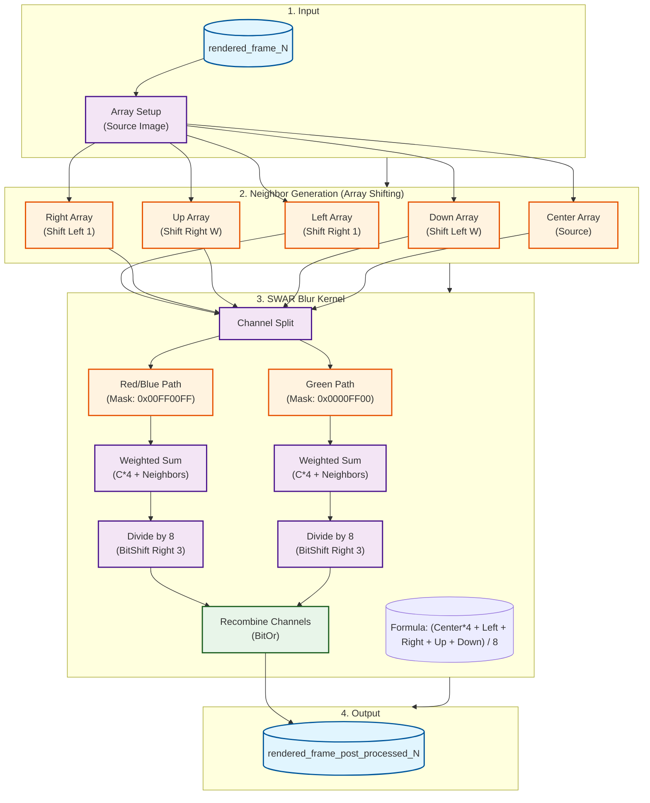

# DOOMHouse Post-Processing Architecture

This diagram illustrates the "Fast Gaussian Blur" pipeline implemented in `post_process_view.sql`. The rendering engine splits the workload into 4 parallel Materialized Views. This diagram shows the logic for **one single view** (e.g., Quarter 1).

