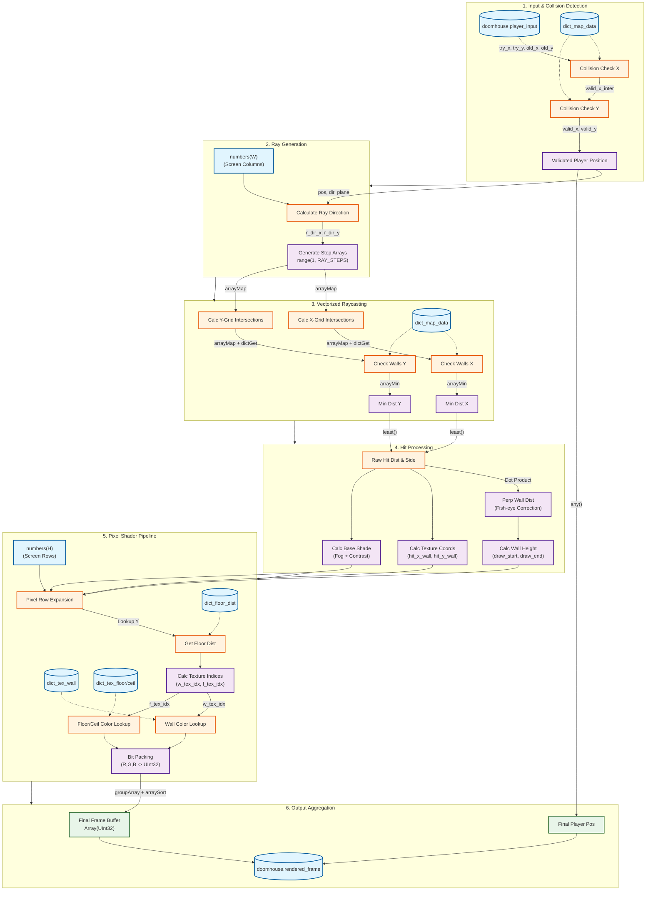

# DOOMHouse Rendering Architecture

This diagram illustrates the data flow and processing steps within the `render_view_org.sql` Materialized View. It details how player input is transformed into a rendered frame entirely within ClickHouse SQL.

