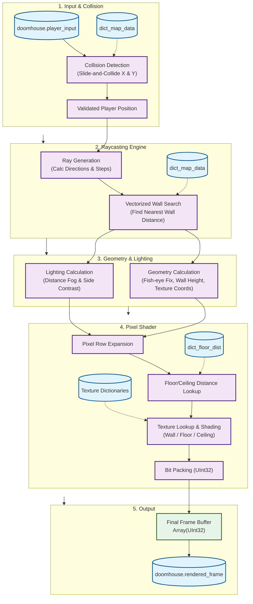

# DOOMHouse Rendering Architecture

This diagram illustrates the high-level data flow within the `render_view_org.sql` Materialized View.

```mermaid
flowchart TD
    %% Styling
    classDef storage fill:#e1f5fe,stroke:#01579b,stroke-width:2px;
    classDef process fill:#f3e5f5,stroke:#4a148c,stroke-width:2px;
    classDef output fill:#e8f5e9,stroke:#1b5e20,stroke-width:2px;

    subgraph InputStage ["1. Input & Collision"]
        PI[("doomhouse.player_input")]:::storage --> CD["Collision Detection<br/>(Slide-and-Collide X & Y)"]:::process
        MD1[("dict_map_data")]:::storage -.-> CD
        CD --> VP["Validated Player Position"]:::process
    end

    subgraph Raycasting ["2. Raycasting Engine"]
        VP --> RG["Ray Generation<br/>(Calc Directions & Steps)"]:::process
        RG --> VWS["Vectorized Wall Search<br/>(Find Nearest Wall Distance)"]:::process
        MD2[("dict_map_data")]:::storage -.-> VWS
    end

    subgraph Geometry ["3. Geometry & Lighting"]
        VWS --> GLC["Geometry Calculation<br/>(Fish-eye Fix, Wall Height, Texture Coords)"]:::process
        VWS --> LS["Lighting Calculation<br/>(Distance Fog & Side Contrast)"]:::process
    end

    subgraph PixelShader ["4. Pixel Shader"]
        GLC & LS --> PRE["Pixel Row Expansion"]:::process
        PRE --> FCD["Floor/Ceiling Distance Lookup"]:::process
        FDD[("dict_floor_dist")]:::storage -.-> FCD
        
        FCD --> TL["Texture Lookup & Shading<br/>(Wall / Floor / Ceiling)"]:::process
        TD[("Texture Dictionaries")]:::storage -.-> TL
        
        TL --> BP["Bit Packing (UInt32)"]:::process
    end

    subgraph OutputStage ["5. Output"]
        BP --> FF["Final Frame Buffer<br/>Array(UInt32)"]:::output
        FF --> MV[("doomhouse.rendered_frame")]:::storage
    end

    %% Flow Connections
    InputStage --> Raycasting
    Raycasting --> Geometry
    Geometry --> PixelShader
    PixelShader --> OutputStage
```
