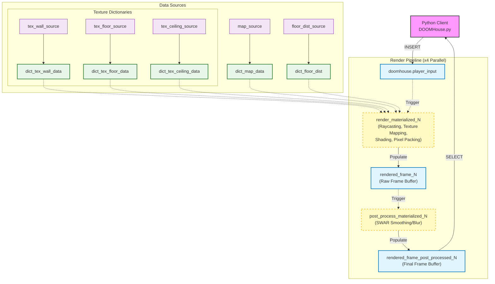

# DOOMHouse Architecture

## Render Engine Pipeline

The following diagram illustrates the pipeline architecture of the DOOMHouse Render Engine. Note that the rendering process is parallelized across four "quarters" of the screen (x4), but for simplicity, only one pipeline is shown below.

