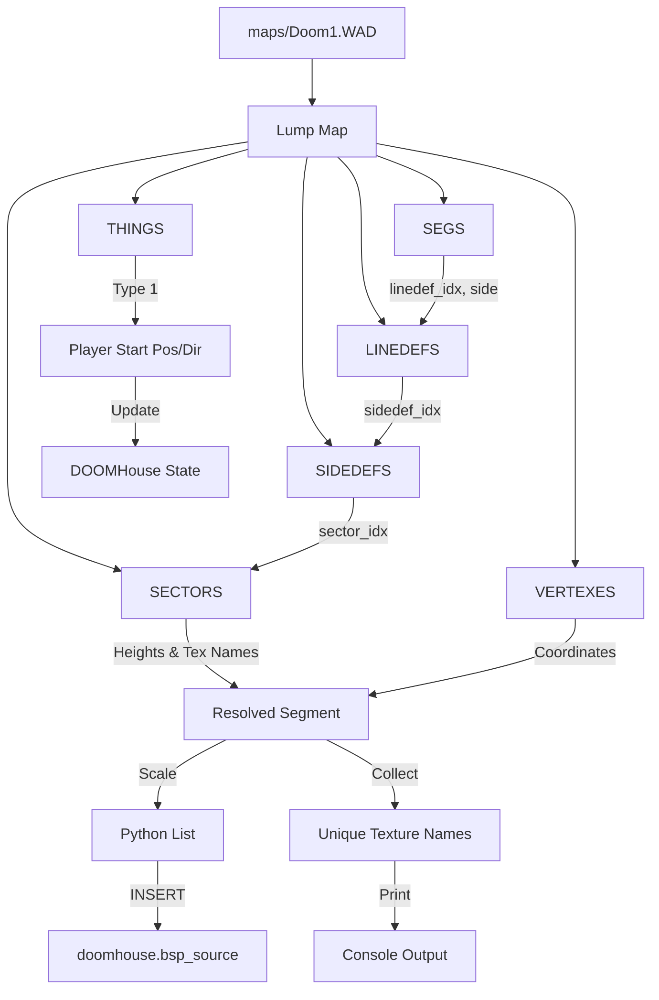

# Technical Implementation Plan: Loading BSP Segments, Sector Heights, and Player Start from Doom WAD

This plan outlines the implementation of the `initialize_game_data` method in [`src/DOOMHouse.py`](src/DOOMHouse.py:436) to parse and load BSP segments, sector heights, and the player's starting position from `maps/Doom1.WAD`.

## 1. Objective
Replace the hardcoded square room and starting position with actual level geometry and the official Player 1 start location from "E1M1".

## 2. WAD File Format Specification

### Header (12 bytes)
| Offset | Size | Type | Description |
|--------|------|------|-------------|
| 0      | 4    | char[4] | Identification ("IWAD" or "PWAD") |
| 4      | 4    | int32 | Number of lumps in the WAD |
| 8      | 4    | int32 | File offset to the directory |

### Directory Entry (16 bytes)
| Offset | Size | Type | Description |
|--------|------|------|-------------|
| 0      | 4    | int32 | File offset to the lump data |
| 4      | 4    | int32 | Size of the lump in bytes |
| 8      | 8    | char[8] | Name of the lump (ASCII, null-padded) |

## 3. Level Data Structures

### VERTEXES (4 bytes)
- `x`, `y`: `int16` coordinates.

### SEGS (12 bytes)
- `v1`, `v2`: `int16` vertex indices.
- `angle`: `int16` BAMS angle.
- `linedef`: `int16` index of the parent linedef.
- `side`: `int16` (0 for front, 1 for back).
- `offset`: `int16` distance along the linedef.

### LINEDEFS (14 bytes)
- `v1`, `v2`: `int16` vertex indices.
- `flags`, `special`, `tag`: `int16`.
- `sidenum`: `int16[2]` (indices of the front and back sidedefs).

### SIDEDEFS (30 bytes)
- `xoffset`, `yoffset`: `int16`.
- `upper`, `lower`, `middle`: `char[8]` texture names.
- `sector`: `int16` index of the parent sector.

### SECTORS (26 bytes)
- `floorheight`, `ceilingheight`: `int16`.
- `floortex`, `ceilingtex`: `char[8]` texture names.
- `lightlevel`, `special`, `tag`: `int16`.

### THINGS (10 bytes)
- `x`, `y`: `int16`.
- `angle`: `int16` (degrees).
- `type`: `int16` (Player 1 Start is type 1).
- `options`: `int16`.

## 4. Texture Handling Note
Doom textures are stored in a proprietary "patch" format and require a palette (`PLAYPAL`) for rendering. 
- **Current Scope**: We will continue using the engine's theme-based PNG textures (e.g., `texture20.png`) for all walls, floors, and ceilings.
- **Logging**: We will extract the texture names (e.g., `BROWN1`, `FLOOR0_1`) during parsing and **print a summary of unique texture names** found in the level to the console.
- **Future Proofing**: Texture names will be stored in the Python segment objects for future implementation of per-segment texturing.

## 5. Implementation Steps

### Step 1: Directory Indexing
1. Open `maps/Doom1.WAD` and read the header.
2. Load the directory into a dictionary mapping lump names to `(offset, size)`.
3. Locate the "E1M1" marker and identify the offsets for the six lumps listed above.

### Step 2: Binary Parsing
1. **Parse VERTEXES**: Store as a list of `(x, y)` tuples.
2. **Parse SECTORS**: Store as a list of `(floor, ceil, floor_tex, ceil_tex)` tuples.
3. **Parse SIDEDEFS**: Store as a list of `(sector_index, upper_tex, lower_tex, middle_tex)`.
4. **Parse LINEDEFS**: Store as a list of `(front_side, back_side)` tuples.
5. **Parse SEGS**: Store as a list of raw segment data.
6. **Parse THINGS**: Search for the first entry with `type == 1`.

### Step 3: Player Start Resolution
1. Extract `x`, `y`, and `angle` from the Player 1 `THING`.
2. **Scaling**: Scale `x` and `y` by `0.01`.
3. **Direction**: Convert `angle` (degrees) to `dir_x`, `dir_y` and `plane_x`, `plane_y`.
   - `dir_x = cos(angle)`, `dir_y = sin(angle)`
   - `plane_x = -sin(angle) * 0.66`, `plane_y = cos(angle) * 0.66`
4. Update `self.pos_x`, `self.pos_y`, `self.dir_x`, `self.dir_y`, `self.plane_x`, `self.plane_y`.

### Step 4: Height and Texture Resolution Logic
For each segment in the `SEGS` lump:
1. Get `linedef_idx` and `side_idx` (0 or 1).
2. Look up `LINEDEF[linedef_idx]` to get the `sidedef_idx` for the given side.
3. Look up `SIDEDEF[sidedef_idx]` to get the `sector_idx` and wall texture names.
4. Look up `SECTOR[sector_idx]` to get `floorheight`, `ceilingheight`, and floor/ceiling texture names.
5. Collect all unique texture names in a set.

### Step 5: Scaling and Normalization
1. **Coordinates**: Scale `x` and `y` by `0.01`.
2. **Heights**: Scale `floorheight` and `ceilingheight` by `0.01`.

### Step 6: Database Integration
1. Clear `doomhouse.bsp_source`.
2. Insert the resolved segments: `[id, x1, y1, x2, y2, ceil, floor]`.
3. Reload the `dict_bsp_segs` dictionary.
4. **Print Texture Summary**: Output the list of unique texture names found to the console.

## 6. Data Flow Diagram

## 7. Success Criteria
- The player spawns at the correct E1M1 starting location.
- The engine renders E1M1 with varying floor and ceiling heights.
- A list of unique texture names (e.g., `BROWN1`, `STARTAN3`) is printed to the console.
- Performance remains stable with the increased number of segments.
