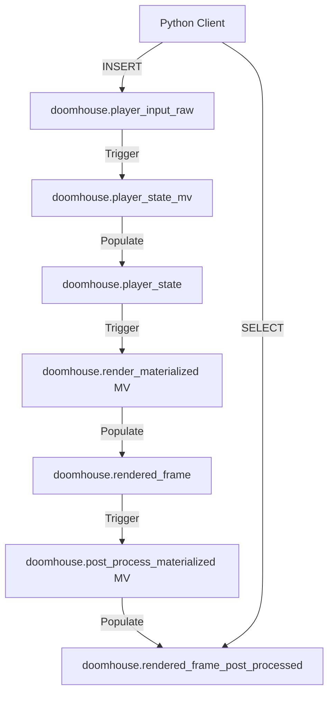

# Plan: Porting DOOMHouse to BSP Architecture

This plan outlines the necessary changes to transition the DOOMHouse engine from a raycasting approach to a BSP-based rendering pipeline.

## 1. SQL Schema Updates

### 1.1. Rename Input Table
Update [`src/SQL/player_input_table.sql`](src/SQL/player_input_table.sql:1) to define `doomhouse.player_input_raw`. This table will receive the raw movement requests from the Python client.

### 1.2. Create Player State Table
Create `src/SQL/player_state_table.sql` to define `doomhouse.player_state`.
- Columns: `valid_x`, `valid_y`, `dir_x`, `dir_y`, `plane_x`, `plane_y`.
- This table acts as the source of truth for the camera position and orientation after collision resolution.

### 1.3. Update Source Tables
Update [`src/SQL/create_source_tables.sql`](src/SQL/create_source_tables.sql:1) to include:
- `doomhouse.bsp_source`: Stores wall segment data (`x1`, `y1`, `x2`, `y2`, `ceil`, `floor`).

### 1.4. Update Dictionaries
Update [`src/SQL/create_dictionaries.sql`](src/SQL/create_dictionaries.sql:1) to include:
- `dict_bsp_segs`: O(1) lookup for wall segments, used by both `player_state_mv` and `render_materialized`.

## 2. Logic Refinement

### 2.1. Fix `src/SQL/player_state.sql`
- Ensure `plane_x` and `plane_y` are passed through from `player_input_raw` to `player_state`.
- Replace the reference to `dict_vectors` with `dict_bsp_segs`.
- Ensure the `CROSS JOIN` and `LEFT JOIN` logic correctly iterates over the segments defined in `dict_bsp_segs`.

### 2.2. Fix `src/SQL/render_view.sql`
- Update the `WITH` clause to read `p_plane_x` and `p_plane_y` from `doomhouse.player_state`.
- Ensure the `dictGet` calls for textures use the names expected by the Python client (or update the client to match).

## 3. Python Client Updates ([`src/DOOMHouse.py`](src/DOOMHouse.py:53))

### 3.1. Table and View Management
- Update `cleanup_database` to drop the new `player_input_raw`, `player_state`, and `player_state_mv`.
- Update `initialize_tables` to execute the new SQL scripts in the correct order.

### 3.2. Input Handling
- Update `push_input` to insert data into `doomhouse.player_input_raw`.

### 3.3. Texture Initialization
- Update `initialize_texture` to ensure the dictionary names match those used in the new `render_view.sql` (e.g., `dict_tex_wall`).

### 3.4. Map Data Population
- Implement logic to populate `bsp_source` with segment data.

## 4. Pipeline Flow

## 5. Documentation
- Update the Memory Bank ([`architecture.md`](.kilocode/rules/memory-bank/architecture.md:1), [`context.md`](.kilocode/rules/memory-bank/context.md:1)) to reflect the shift from raycasting to BSP.
